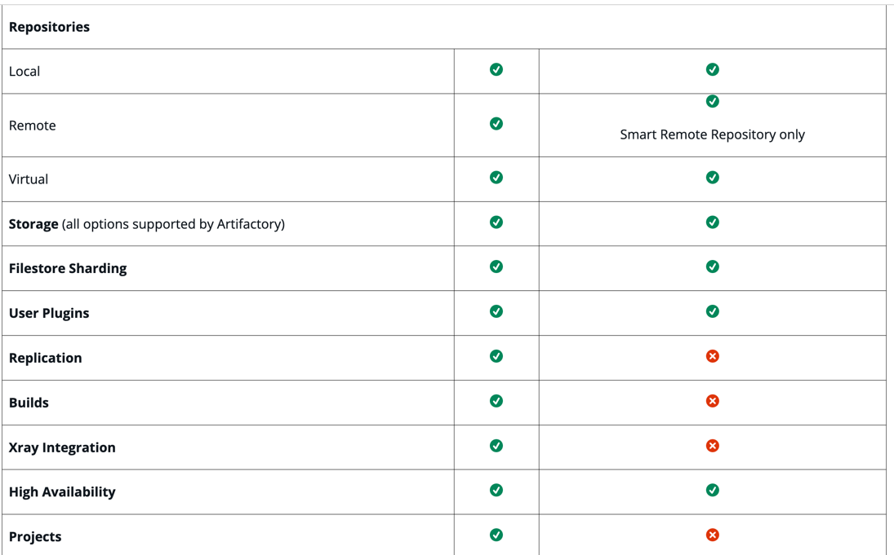

https://jfrog.com/help/r/get-started-with-the-jfrog-platform/jfrog-artifactory-edge

* requirements
  * Enterprise+ license

* JFrog Artifactory Edge or Edge node
  * == JFrog Artifactory / 👀-- customized to -- distribute software | runtime👀 
    * _Example:_ data center, point-of-sale, mobile device
  * 's packages hosted
    * == part of a Release Bundle
  * [how to install](jfrog-installation-setup-documentation.installing-artifactory-edge.md)
  * upload artifacts
    * ways
      * [UI](jfrog-artifactory-documentation.deploying-artifacts.md)
      * [REST API](http/artifactory%20REST%20APIs/artifactsAndStorage.http)
    * 👀ALL -- must be directed to the -- "artifactory-edge-uploads" generic repository👀
      * "artifactory-edge-uploads" generic repository
        * AUTOMATICALLY created
        * ❌can NOT be created ❌
        
  * vs JFrog Artifactory
    
    

* REST API
  * [v1](https://jfrog.com/help/r/jfrog-rest-apis/distribute-release-bundle-v1-version)
  * [v2](https://jfrog.com/help/r/jfrog-rest-apis/distribute-release-bundle-version-v2)

## Distribution flow
* == create release bundle + distribute a release bundle
  * create a Release Bundle
    * -- via -- 
      * [create Release Bundle Version REST API call](https://jfrog.com/help/r/jfrog-rest-apis/create-release-bundle-v1-version) 
      * UI
  * distribute a release bundle
    * trigger the replication process / happens FROM the source Artifactory -- to the -- Edge nodes
      * replicates the Release Bundle info | EACH Edge Node
      * initiates the replication process | source Artifactory
    * ends the distribution transaction
      * JFrog Distribution -- notifies to the -- Edge node 
        * transaction complete
      * Edge node 
        * validates  
          * integrity of the transferred Release Bundle
          * Release Bundle -- , via 's checksum, as a -- unit
        * hosts checksum | correct place
* TODO:

## Pulling Artifacts
* TODO:

## Setting a GPG Key
* TODO:

## NGINX Configuration
* TODO:
