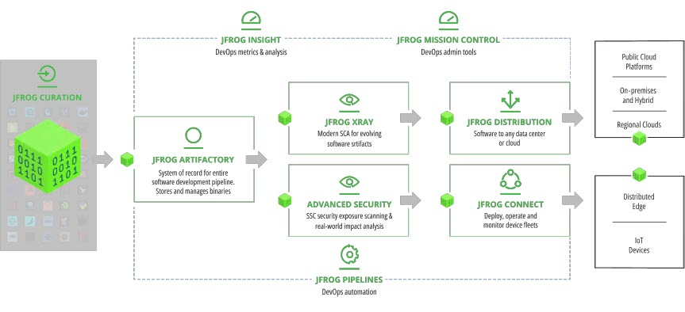

https://jfrog.com/help/r/get-started-with-the-jfrog-platform/jfrog-platform-overview

* [overview](overview.md)
* JFrog Platform
  * == UI / unify ALL JFrog products
  * features
    * universal repository manager
      * -- via -- [JFrog Artifactory](jfrog-artifactory-documentation.jfrog-artifactory.md)
    * reduce security & compliance risk
      * -- via -- [JFrog XRay](jfrog-security-documentation.jfrog-xray.md)
    * optimize release processes
      * -- via -- [JFrog Mission Control](get-started-with-the-jfrog-platform.jfrog-mission-control.md)
    * deliver global updates
      * -- via -- [JFrog Distribution](jfrog-distribution-documentation.jfrog-distribution.md)

* https://www.youtube.com/watch?v=r8nscXdb7y4
  * TODO:
