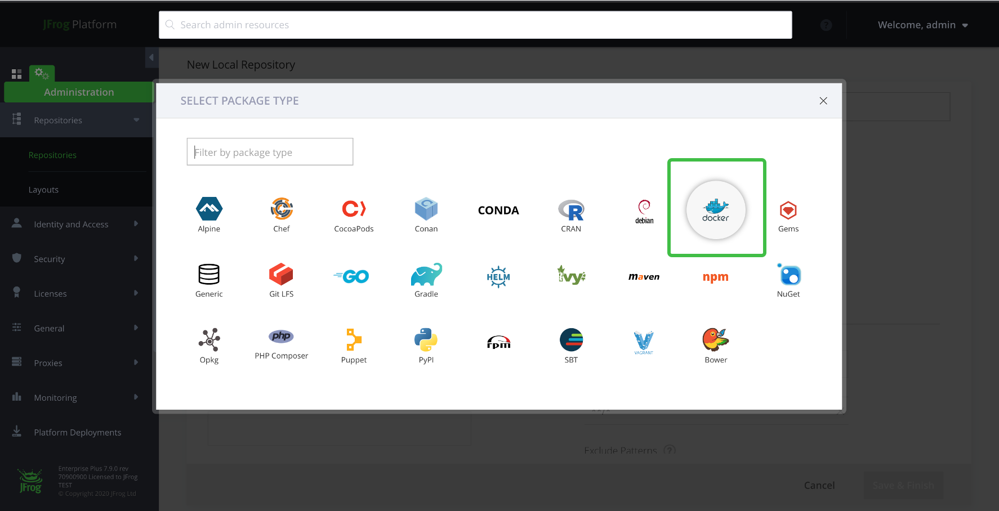
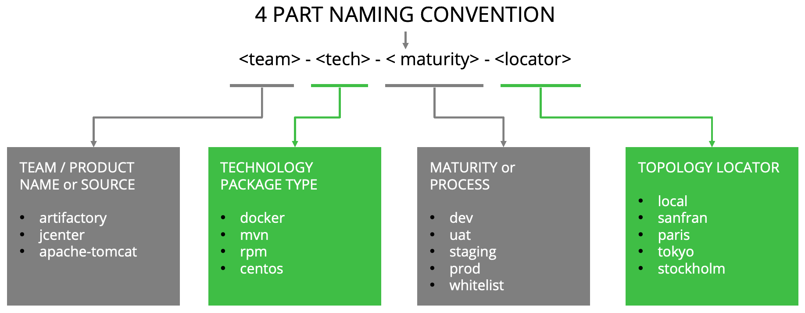
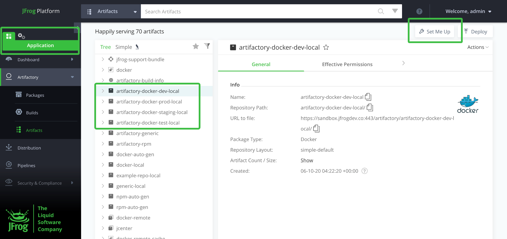
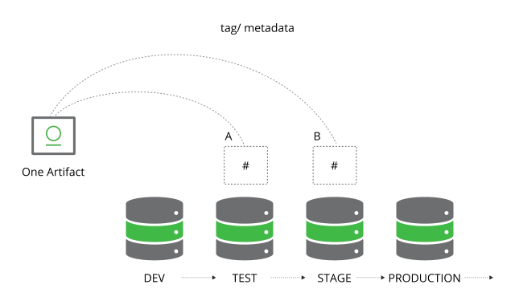

https://jfrog.com/help/r/get-started-with-the-jfrog-platform/onboarding-best-practices-jfrog-artifactory

# Repository design
* repository types
  * local
    * managed
      * locally
      * physically
  * remote
    * == remote server's caching proxies -- by --
      * resolve the artifact -- from the -- remote server
      * store the artifact | local cache
  * virtual
    * simplify search
    * build processes -- by -- aggregating local & remote repositories | 1! URL

* 👀EACH repository -- is constructed for -- 1 defined package type 👀
  * _Example:_ | Maven package integration, create a Maven repository structure
  * ⚠️EXCEPTION: package type Generic -- accept -- ANY file format ⚠️
  

# Naming conventions

* `<team>-<technology>-<maturity>-<locator>`
  * Reason: 🧠enables you, about your global repositories,
    * scale
    * manage 🧠
  * `<technology>`
    * == technology OR tool OR package type
  * `<locator>`
    * your artifacts' physical topology
  

# repository structure / mirrors development lifecycle

* Reason: 🧠intuitive promotion of the artifact -- ACROSS -- DIFFERENT stages🧠
* _Example:_ 4 stage development life cycle -> 4 repositories
  

* JFrog Artifactory
  * ❌NOT deploy artifacts | quarantined area ❌
  * tags artifacts -- with -- metadata / EACH stage
    
    * promotion properties
      * enable set permissions | artifacts / tagged -- with -- those properties
