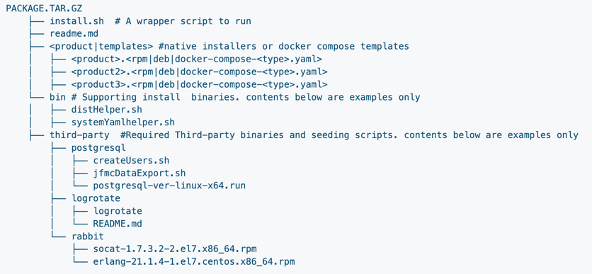

https://jfrog.com/help/r/jfrog-installation-setup-documentation/install

* Supported Installer Distribution Types
  * Helm Chart (Recommended)
  * Docker Compose
  * Debian
  * RPM
  * Linux Archive
  * Windows

* ALLOWED modes
  * 1! node
  * High Availability (HA) mode

* package structure, if package contains 
  * ALSO NON-native installers OR
  * non-archive installers
  

* if you want to install ANY JFrog product -> steps
  * download the package to install
    * _Example:_ Standalone, RPM, Debian, Docker Compose, Helm
  * extract the package -- according to the -- installer distribution type (Extract, yum, Wget, Docker Compose, Helm)
  * if you want to customize the product configuration -> 
    * modify the System YAML configuration file OR
    * set environment variables
  * Start the service -- via -- 
    * start scripts OR
    * OS service management