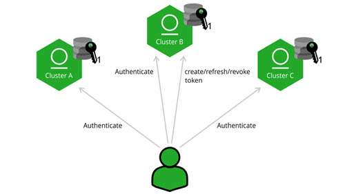

https://jfrog.com/help/r/jfrog-platform-administration-documentation/access-tokens

* TODO:

## Circle of Trust (Cross-Instance Authentication)

* requirements
  * access -- to the -- target Platform Deployments 
  * source Platform Deployments' root certificate
  * share a public certificate AMONG ALL participating instances

* cross-instance authentication -- through a -- "circle of trust"
  * -- supported by -- Access tokens
  * == 👀service verify access token signatures -- AGAINST -- ALL trusted certificates 👀
    * ALSO certificates / 
      * generated -- by -- OTHER services &
      * circle of trust == 'trusted' 
    * service administrator -- need to verify that -- ALL participating instances -- are equipped with the -- certificates
  * ANY instance -- can generate a -- token / used with any other instance within the circle of trust.

### use cases

* series of JPDs / need to be -- , via 1! set of credentials, -- accessed
  * _Example:_ 1! build agent / needs to
    * upload
    * download -- from -- 2 JPD instances
  * if you create a circle of trust -> ensure that 1 JPD instance -- will trust -- ANOTHER instance’s tokens
    * share the public token certificate BETWEEN ALL circle's instances

* \| run the sever (WITHOUT restarting), trusted certificates -- can be -- 
  * loaded
  * removed

### how to establish?

* TODO: