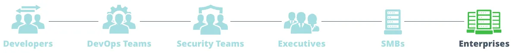

https://jfrog.com/

- := Software Supply Chain Platform
    - allows
        - build
        - distribute
        - automate software updates
    - characteristics
        - Universal Package Management
            - by [JFrog Artifactory](jfrog-artifactory-documentation.jfrog-artifactory.md)
        - Advanced Security for DevOps
            - by [JFrog Xray](jfrog-security-documentation.jfrog-xray.md)
        - Next-Gen CI/CD
            - by [JFrog Pipelines](jfrog-pipelines-documentation.jfrog-pipelines.md)
        - Updates from Code → Device
            - by [JFrog Distribution](jfrog-distribution-documentation.jfrog-distribution.md)
        - Truly Hybrid & Multi-cloud
        - Scale DevSecOps
        - IoT device management
            - by [JFrog Connect](jfrog-connect-documentation.jfrog-connect-for-edge-and-iot.md)
        - ALL are involved
            
          
            
            - Developers
                - -- bring -- languages / frameworks / technologies / deployment models
                    - following secure DevOps practices
                    - nice experience via
                        - UI
                        - CLI tools
            - DevOps Teams
                - -- optimize -- the team’s delivery with
                    - management at project-level
                    - keeping all in sync
                    - pipelines
                        - flexible
                        - visible
                        - secure
            - Security Teams
                - bridge the gaps between security -- & -- software engineering
            - Executives
                - drive strategies
                  1. global DevOps &
                  2. secure with
                    - 1! integrated platform
            - SMB
                - == Smart Remote Repositories
                - allows
                    - scaling easily
                    - delivering fast
                    - securing

## Companies use cases        
### NVidia
https://youtu.be/WgE8mtgzYR0
- JFrog Artifactory Enterprise PreProd mode
- 20-30 permissions
- 60 repositories
- main benefits
    - store different repository types
    - solution
        - high retrieval
        - high available
        - scalability
    - simplity
    - usability
- repository types used
    - maven
    - npm
    - [rpm](https://www.notion.so/Related-Topics-73733950189342f4a5529d8f33a8feb8?pvs=21)
    - docker registry
    - helm
    - binaries 

### Box
https://www.youtube.com/watch?v=5NYjNqsO2oc
    - speech goal
        - Journey to Kubernetes + JFrog Artifactory
    - Problems they had
        - ≤ 6 months to provision a new microservice

### Boeing
https://www.youtube.com/watch?v=4n4fMAAs8qU
- Problems they had
    - role management access to the artifacts

### Splunk
https://www.youtube.com/watch?v=kiA0-SJGFDM

### SAP
https://www.youtube.com/watch?v=ejLh6cWAEgs
- JFrog Artifactory enterprise
- Problems they had
    - several regions → Primary & Disastery Data Centers → Different Artifactory SetUp
- main benefits
    - promotion through stages
    - build across different data centers
    - fast releasing
    - high scalability
    - several different package repositories

### Kroger
https://www.youtube.com/watch?v=JASwpuPqmi0
- uses of JFrog
    - gateway to all deployments through their CI/CD pipeline in a hybrid cloud deployment
    - Artifactory
        - binary repository
    - XRay
        - scan the security of their artifacts
- main benefits
    - caching
    **Note:** → overcome networking issues from time to time

### RedHat Openshift
https://www.youtube.com/watch?v=0oFUZtMUhmM
- uses
    - add value to Openshift