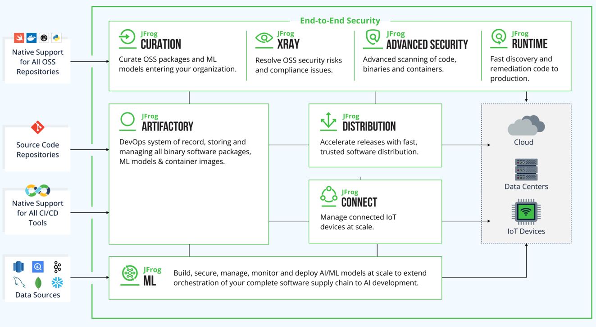

https://jfrog.com/platform/

* == Software Supply Chain Platform -- for -- EveryOps (DevOps, DevSecOps, MLOps & IoTOps) /
  * == SEVERAL modules
* allows
  * Improve Developer Efficiency
    * -- via --
      * builds
      * security scans
  * take to the Clouds (❓TODO:)
    * ALLOWED
      * JFrog’s managed Cloud + your own self hosted instances
  * handle DevSecOps /
    * NOT need any more tools
  * accelerate AI/ML Pipelines
    * Reason: 🧠models == package🧠

* use cases
  * 1! software releases' system of record
  * E2E application security
  * complete traceability of your releases
    * _Example:_ check | they are used
  * built for the enterprise
    * == scaled + governance
  * future proofed
    * == innovate